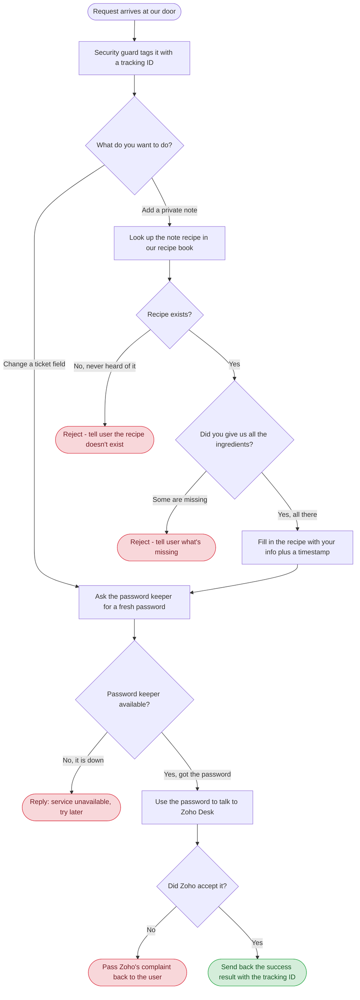
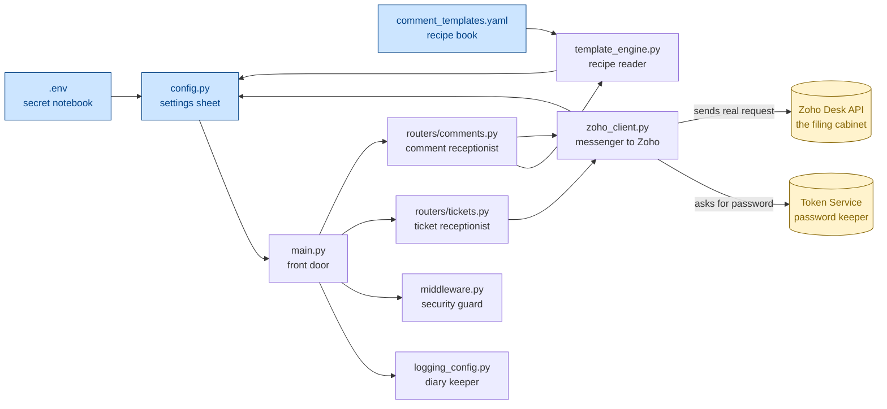

# Zoho Desk Ticket Modifier

A small program that lets you change tickets in Zoho Desk and add notes on them, automatically.

## What It Does

Imagine Zoho Desk as a digital filing cabinet full of customer support tickets. Normally, a person has to open each ticket and click around to update it or write notes. This program does that work for you over the internet — you tell it "change this field on this ticket" or "add this kind of note to this ticket," and it does it.

It can do two things:

1. **Change a field on a ticket** — like updating the subject, status, or priority.
2. **Add a private note to a ticket** — a hidden note that only your team can see, written from a pre-made template (like "we sent a text message to this person" or "we made a robot call").

---

## How a Request Travels Through the System (Lifecycle)

When someone sends the program a request, here's everything that happens behind the scenes, step by step:



**In plain words:** The request comes in, gets stamped so we can trace it later, then we figure out if you want to change a field or add a note. If it's a note, we look up the template you asked for and check you gave us all the right ingredients. Either way, we ask the password keeper for a fresh password (Zoho needs one for every action), then we go talk to Zoho. If anything goes wrong along the way, we send back a friendly explanation. If everything works, we send back the result.

---

## How the Pieces Fit Together (Dependencies)

This shows what each piece of the program does and who talks to whom. The arrows mean "this one calls that one."



**Here's what each piece does, in plain English:**

- **`.env`** — the secret notebook. It's a small text file that holds the addresses and secrets the program needs (like which Zoho organization to talk to). It's kept out of the codebase so secrets don't accidentally get shared.
- **`comment_templates.yaml`** — the recipe book. It lists every type of note you can add (text message sent, robot call made, etc.) and what each note looks like. You can edit it to add new note types without changing any code.
- **`config.py`** — the settings sheet. It reads the secret notebook and gives the rest of the program easy access to those settings.
- **`main.py`** — the front door. This is where the program starts. It opens up an HTTP service, sets up the diary, the security guard, and the receptionists.
- **`logging_config.py`** — the diary keeper. Writes down everything important that happens (good or bad) so we can look back later and figure out what went wrong.
- **`middleware.py`** — the security guard. Stamps every incoming request with a unique tracking ID, then writes in the diary how long the request took.
- **`routers/tickets.py`** — the ticket receptionist. Handles requests that want to change a ticket field. Hands them off to the messenger.
- **`routers/comments.py`** — the comment receptionist. Handles requests that want to add a note. First asks the recipe reader to prepare the note, then hands it to the messenger.
- **`template_engine.py`** — the recipe reader. Looks up which recipe (template) you asked for, checks you gave it all the ingredients (fields), fills in the blanks, and adds a timestamp.
- **`zoho_client.py`** — the messenger to Zoho. Goes to the password keeper to get a fresh password, then carries the actual request to Zoho Desk and brings back the answer.
- **Token Service** *(external)* — the password keeper. Lives at a separate address. Hands out fresh passwords (access tokens) every time someone needs to talk to Zoho.
- **Zoho Desk API** *(external)* — the actual filing cabinet, hosted by Zoho. The real source of truth for tickets and comments.

---

## Endpoints

| Method | Path | Description |
|--------|------|-------------|
| `PATCH` | `/v1/tickets/{id}` | Change one field on a ticket |
| `POST` | `/v1/tickets/{id}/comments` | Add a templated private comment |
| `GET` | `/v1/tickets/comment-types` | List the available note types and what fields they need |
| `POST` | `/v1/tickets/comment-types/reload` | Re-read the recipe book without restarting (useful after editing) |
| `GET` | `/v1/healthz` | Liveness probe — is the program alive? |
| `GET` | `/v1/readyz` | Readiness probe — can the program actually do its job right now? |

Live API docs: open `/docs` in a browser when the service is running.

---

## Comment Types

The program ships with five pre-made note templates. All of them auto-include a UTC timestamp.

| Type | What it records |
|------|-----------------|
| `text_message` | A text message was sent to a person (recipient name, phone, message body) |
| `robot_call` | An automated robot call was made (recipient name, phone, message) |
| `instant_message` | A message was posted to a chat group (group name, message) |
| `desktop_notification` | A desktop popup was shown (which desktop, what the popup said) |
| `live_call` | Someone requested a live call (phone number, which group/chat asked for it) |

To add a new type, just edit `comment_templates.yaml` and call `POST /v1/tickets/comment-types/reload` — no rebuild needed.

---

## Configuration

All settings come from `.env`:

| Variable | Default | Description |
|----------|---------|-------------|
| `TOKEN_SERVICE_URL` | `http://localhost:8000/v1/token` | Where the password keeper lives |
| `ZOHO_DESK_BASE_URL` | `https://desk.zoho.com/api/v1` | Where Zoho Desk lives |
| `ZOHO_ORG_ID` | *(required)* | Your Zoho organization's ID number |
| `LOG_LEVEL` | `INFO` | How chatty the diary keeper should be |
| `LOG_FORMAT` | `json` | `json` for production, `text` for easier reading locally |
| `ZOHO_REQUEST_TIMEOUT` | `30` | How long (seconds) to wait on Zoho before giving up |
| `TOKEN_REQUEST_TIMEOUT` | `10` | How long (seconds) to wait on the password keeper |

---

## Running It Locally

Prerequisites: Python 3.12, [`uv`](https://docs.astral.sh/uv/), and the Zoho token service running on port 8000.

```bash
# Install dependencies
uv sync

# Copy the example settings file and fill in your org ID
cp .env.example .env
# edit .env -> set ZOHO_ORG_ID

# Start the service
uv run uvicorn main:app --host 0.0.0.0 --port 8001 --workers 1

# Browse interactive docs at http://localhost:8001/docs
```

---

## Deployment

When you push code to the `main` branch on GitHub, a CI/CD pipeline automatically:

1. Runs the tests.
2. Builds a fresh Docker image and uploads it to GitHub Container Registry.
3. SSHes into the EC2 server, pulls the new image, and restarts the container.

Doc-only changes (`README.md`, `.gitignore`, `LICENSE`, anything in `credentials/`) do **not** trigger a rebuild — that would be wasteful.

The `.env` file and `comment_templates.yaml` are bind-mounted from the host machine into the container. That means:
- They live on the EC2 host, not inside the image.
- Container rebuilds **never** wipe them.
- You can edit them on the host, hit `POST /v1/tickets/comment-types/reload`, and the changes take effect immediately.
